# **Final Design Overview & Model Explanation**

  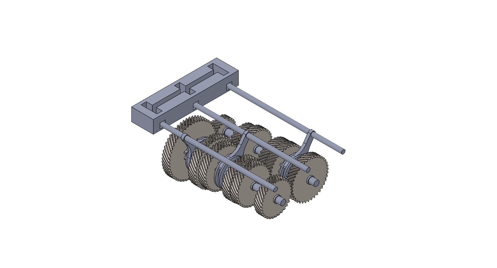
  
<em>Figure 1. Isometric View Without Housing.</em>

  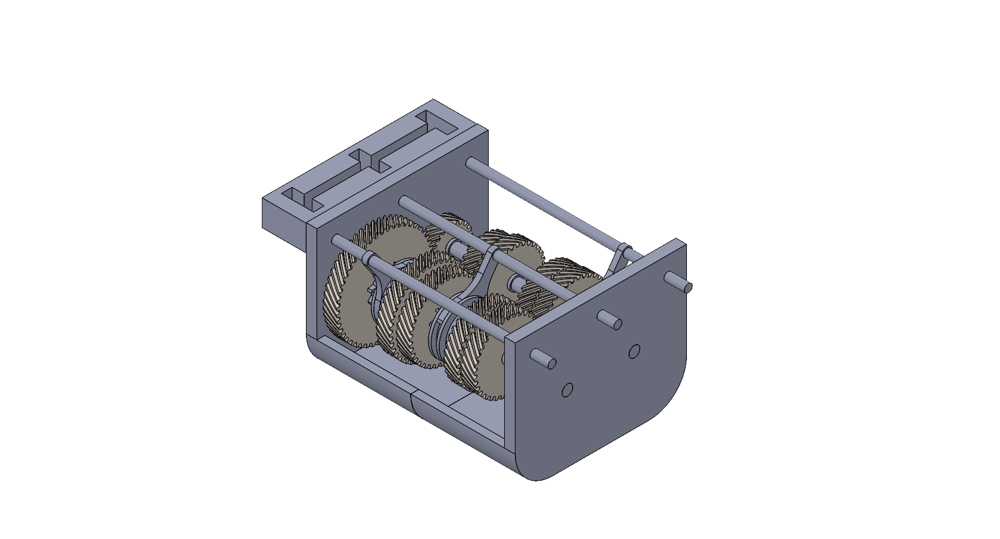
  
<em>Figure 2. Full Model Isometric View.</em>

  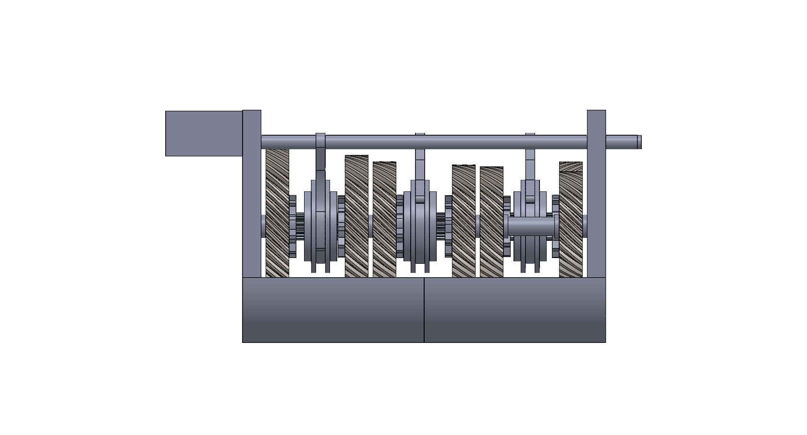
  
<em>Figure 3. Full Model Side View.</em>

  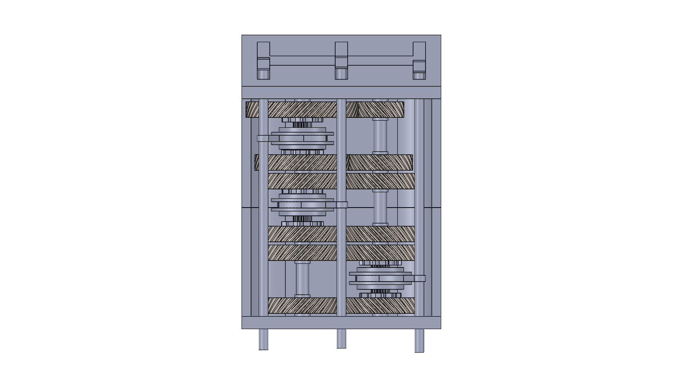
  
<em>Figure 4. Full Model Top View.</em>

 

In the model created in SolidWorks, the input gear spins the output gear that is fixed to the other shaft, creating the desired output torque. Its important to note that these gears are isolated cases since its not depicted well in SolidWorks due to mating capabilities. How it works is that the synchro locks into the selected gear setting using the gear shifter and the inner ring of the synchro is always moving with the shaft. In the assembly, all gears are free floating on the shaft until its mated to be locked to the synchro using mates and constraints.

# **Major Design Decisions & Changes**

**Adjusted gear ratios so that each pair had the same total tooth count (70 tooth total for each pair):**   
The ratios were changed so that it would help with gear meshing in the transmission system while also keeping proper torque and output speeds with each respective gear pair.

**Decreased size of input and output shaft 25.4 mm → 20 mm:**  
After going through a few iterations, the input and output shafts were deemed too thick which would have led to waste of materials when printing and would have affected the power output of the transmission.

**Transmission housing was split into 2 parts:**  
This was done so that the part could actually be printed out using the 3D printers. The plan is to attach both parts together which should cause any issues since it's just the housing that holds everything together.

**Distance between input and output shaft was determined to be 125 mm:**  
This was determined through estimations of calculations and analysis and after finalizing the gear ratio sizes, this was the ideal distance between both shafts.

**Adjusted distance between gear pairs as listed:**
* 1st and 2nd gear 60 mm
* 2nd gear and 3rd gear 5 mm
* 3rd gear and 4th gear 60 mm
* 4th gear to 5th gear 5 mm
* 5th gear to 6th gear 60 mm

This was changed after doing more research on how real world transmission gear pair distances were established. These distances would lower the chances of gears not meshing or possible misalignment in the system.

  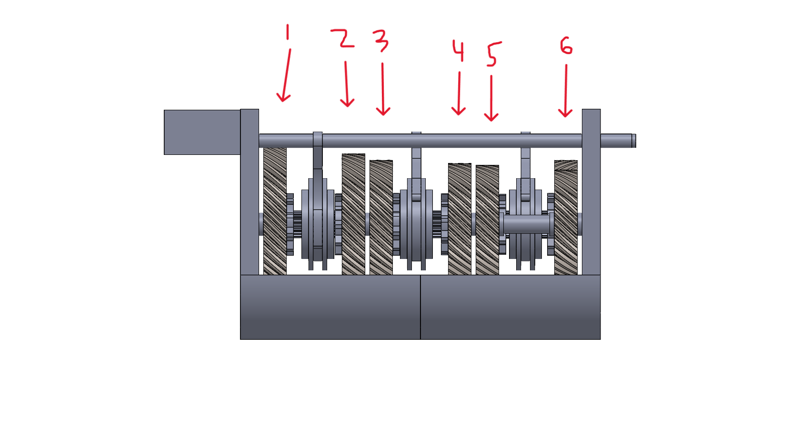
  
<em>The image given above serves as a reference to which gear pair is which and the one we are referring to in this report.</em>

# **Detailed Explanation Of Analyses**

## <ins>**Static Stress and Factor of Safety**</ins>

We performed a static stress analysis focusing on the transmission’s response to a peak input torque of 500 N.m. Considering the fact that this model is roughly half the size of an actual model, this input torque seems reasonable for our purposes. Our analysis tracked the torque multiplication across all six gear pairs, reaching a maximum output of 593.75 N.m in the sixth gear. By applying these loads to our 40 mm shafts, we evaluated the bending and torsional stresses against the material's yield strength. 

NGO = number of teeth on output gear  
NGI = number of teeth on input gear  

  
| Gear Pair | Input Teeth (NGI) | Output Teeth (NGO) | Input Diameter [mm] | Output Diameter [mm] |
|:-------|:-------|:-------|:-------|:-------|
| **Gear 1** | 50 | 20 | 181.78 | 75.71 |
| **Gear 2** | 42 | 28 | 153.49 | 103.99 |
| **Gear 3** | 38 | 32 | 139.35 | 118.14 |
| **Gear 4** | 36 | 34 | 132.28 | 125.21 |
| **Gear 5** | 35 | 35 | 128.74 | 128.74 |
| **Gear 6** | 32 | 38 | 118.14 | 139.35 |

### 6th Gear Input / 1st Gear Output 

### 1. Parameters and Assumptions

$$
P = 10 \ \text{hp}, \quad V = 1000 \ \text{ft/min}
$$

$$
\psi = 15^\circ, \quad \phi_n = 14.5^\circ
$$

$$
T = 500 \ \text{N.m} = 500{,}000 \ \text{N.mm}
$$

$$
d_p = 3584 \ \text{mm}, \quad x = 332.5 \ \text{mm}, \quad L = 350 \ \text{mm}
$$

---

### 2. Tangential Load

Torque-based relation:

$$
W_t = \frac{2T}{d_p} = \frac{2(500000)}{3584} = 279.02 \ \text{N}
$$

---

### 3. Gear Forces

Transverse pressure angle:

$$
\tan(\phi_t) = \frac{\tan(14.5^\circ)}{\cos(15^\circ)}
$$

$$
\phi_t \approx 15.1^\circ
$$

Forces:

$$
W_a = W_t \tan(\psi) = 279.02 \tan(15^\circ) = 74.76 \ \text{N}
$$

$$
W_r = W_t \tan(\phi_t) = 279.02\tan(15.1^\circ) = 74.70 \ \text{N}
$$

---

### 4. Shaft Reactions

#### Horizontal Plane

$$
R_{Bx} = \frac{W_t x}{L} = \frac{279.02 \cdot 332.5}{350} = 265.067 \ \text{N}
$$

$$
R_{Ax} = W_t - R_{Bx} = 279.02 - 265.067 = 13.9509 \ \text{N}
$$

$$
M_x = R_{Ax} \cdot x = 13.9509 \cdot 332.5 = 4638.7\ \text{N.mm}
$$

---

#### Vertical Plane

$$
M_{\text{axial}} = W_a \left(\frac{d_p}{2}\right) = 74.76 \cdot 90.59 = 6772.5 \ \text{N.mm}
$$

$$
R_{By} = \frac{W_r x + M_{\text{axial}}}{L}
$$

$$
R_{By} = \frac{74.70 \cdot 332.5 + 6772.5}{350} = 90.3192 \ \text{N}
$$

$$
R_{Ay} = W_r - R_{By} = 74.70 - 90.3192 = -15.6148 \ \text{N}
$$

$$
M_y = |R_{Ay} x| = -15.6148 \cdot 332.5 = 5191.9 \ \text{N.mm}
$$

---

### 5. Total Bending Moment

$$
M_{\text{total}} = \sqrt{M_x^2 + M_y^2}
$$

$$
M_{\text{total}} = \sqrt{(4638.7)^2 + (5191.9)^2} = 6962.3 \ \text{N.mm}
$$

---

### 6. Shaft Geometry

$$
d_o = 40 \ \text{mm}, \quad d_i = 34 \ \text{mm}
$$

$$
I = \frac{\pi}{64}(d_o^4 - d_i^4) = 0.60 \times 10^5 \ \text{mm}^4
$$

$$
J = \frac{\pi}{32}(d_o^4 - d_i^4) = 1.20 \times 10^5 \ \text{mm}^4
$$

$$
c = 20 \ \text{mm}
$$

$$
A = \frac{\pi}{4}(d_o^2 - d_i^2) = 348.7 \ \text{mm}^2
$$

---

### 7. Stress Calculations

Bending stress:

$$
\sigma_b = \frac{M_{\text{total}} c}{I} = \frac{6962.3 \cdot 20}{0.60 \times 10^5} = 2.32 \ \text{MPa}
$$

Axial stress:

$$
\sigma_{\text{axial}} = \frac{W_a}{A} = \frac{74.76}{348.7} = 0.21 \ \text{MPa}
$$

Torsional stress:

$$
\tau = \frac{T c}{J} = \frac{500000 \cdot 20}{1.20 \times 10^5} = 83.24 \ \text{MPa}
$$

Combined stress:

$$
\sigma_x = 2.32 + 0.21 = 2.53 \ \text{MPa}
$$

Von Mises:

$$
\sigma_{\text{vm}} = \sqrt{(2.53)^2 + 3(83.24)^2} = 144.20 \ \text{MPa}
$$

---

<!--
$T = 500 \ \text{N.m}$

$d = 3.584 \ \text{m} = \text{pitch diameter}$

$\theta_t = 14.5 = \text{Transverse Pressure Angle}$

  
$W_t = \dfrac{2 \cdot T}{d}$

$W_t = 279.018 \ \text{N}$

 

$W_r = W_t \cdot \tan(\theta_t)$

$W_r = 74.70 \ \text{N}$

 

$W_{\text{total}} = 13248.807 \ \text{N}$

 

$\tau = \dfrac{T \cdot c}{J}$

$\tau = 318.3 \ \text{MPa}$

  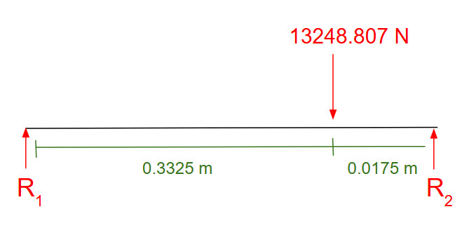

From the FBD:

$R_2 = 12586.366 \ \text{N}$

$R_1 = 662.441 \ \text{N}$

$M_R = 220.2616 \ \text{N.m}$

 

$$\sigma = \frac{M \cdot c}{I} + \frac{W_a}{A} = \frac{220.2616 \cdot 0.01}{\dfrac{\pi}{64}(0.02)^4} + \frac{11491}{\pi(0.01)^2} = 280.446 \cdot 10^6 + 36.577 \cdot 10^6 = 317.023 \ \text{MPa}$$

$$\sigma_{vm} = \sqrt{\sigma^2 + 3\tau^2}$$

$$\sigma_{vm} = 618.54 \ \text{MPa}$$

------------------------------------------------------------------------

### 6th Gear Input / 1st Gear Output - Shaft Bending With Helical Gears

$\phi_h : \text{Helix angle = 42.592}$

  
$W_a = W_t \cdot \tan(\phi_h)$

$W_a = 11491 \ \text{N}$

 

$\sigma_b = \dfrac{32 \cdot M}{\pi d^3} = \dfrac{32 \cdot 418.849}{\pi \cdot (20)^3} = 533.3 \ \text{MPa}$

$\sigma_a = \dfrac{W_a}{A} = \dfrac{11491}{\pi(0.01)^2} = 36.6 \ \text{MPa}$

$\tau = 318.3 \ \text{MPa}$

$\sigma_x = \sigma_b + \sigma_a = 569.9 \ \text{MPa}$

$\sigma_{vm} = \sqrt{569.9^2 + 3(318.3)^2} = 762.9 \ \text{MPa}$

 
-->

Repeating this process for the other 5 pairs of gears since all the calculations will run a similar format just like the one shown above. The only variables that are changing for each gear pair are the distances from bearing, gear ratios, and gear dimensions such as the diameter. All the critical data values were calculated and shown below in the table.

| Gear | Distance from Bearing $(x)$ | Max Bending Moment $(M_R)$ | Bending Stress $(\sigma_b)$ | Axial Stress $(\sigma_a)$ | Normal Stress $(\sigma_x)$ | Von Mises Stress $(\sigma_{vm})$ | 
|:-------|:-------|:-------|:-------|:-------|:-------|:-------|
| **1st** |  17.5 mm | 19.459 N.m | 0.65 MPa | 0.09 MPa | 0.74 MPa | 144.18 MPa | 
| **2nd** |  102.5 mm | 11.97 N.m | 3.99 MPa | 0.12 MPa | 4.11 MPa | 144.24 MPa |
| **3rd** |  132.5 mm | 16.575 N.m | 5.52 MPa | 0.15 MPa | 5.67 MPa | 144.29 MPa | 
| **4th** |  217.5 mm | 18.302 N.m | 6.09 MPa | 0.17 MPa | 6.26 MPa | 144.31 MPa | 
| **5th** |  247.5 mm | 16.945 N.m | 5.64 MPa | 0.18 MPa | 5.82 MPa | 144.30 MPa | 
| **6th** |  332.5 mm | 6.9623 N.m | 2.32 MPa | 0.21 MPa | 2.53 MPa | 144.20 MPa | 

## Static Stress Analysis Conclusion

Looking at the stresses applied to the system, the assumed material of alloy steel that will be used to build this transmission will hold as our calculated Von Mises stress will be under the yield strength of the material which will support all the forces and multiaxial stresses. This problem was solved by decreasing the angle of the helical gear and increasing the shafts diameter from 20 mm to 40 mm. Changing both of these dimensions would significantly reduce the stresses acting upon the shafts allowing it to handle the initial input torque. This high-torque scenario represents our primary safety constraint, and the results confirm that after changing the shaft geometry and comparing it with the material selection, it provides a robust factor of safety, preventing permanent deformation during sudden gear shifts or heavy acceleration.

## <ins>**Fatigue Assessment**</ins>

The fatigue assessment was conducted to ensure the transmission's reliability over its full service life, scaling the engine speed to appropriately match the model which is a speed of 667 RPM. Because the input and output shafts rotate under load, they are subject to cyclic stress that can lead to crack initiation. We applied the Modified Goodman Criterion to these components, focusing on the points where the shaft diameter transitions to 40 mm. By confirming that our operating stresses remain well below the endurance limit of the material, we ensure the transmission can withstand millions of cycles without fatigue failure, even at high-speed operation where the pitch line velocity reaches approximately 9.948 m/s.

d = pitch diameter (mm)  
n = pinion speed (rpm) = 2375  
N = number of teeth of highest gear = 32  
m = module = 2.5 (mm)

  
 d = m * N = 32 * 2.5 = 80 mm

 V = $\frac{π* d * n}{60 * 1000}$ = $\frac{π* 80 *2375}{60 * 1000}$ = 9.948 m/s

### 1. Parameters and Assumptions

$$
\psi = 15^\circ, \quad \phi_n = 14.5^\circ
$$

$$
T = 500 \ \text{N.m} = 500{,}000 \ \text{N.mm}
$$

$$
d_p = 3584 \ \text{mm}, \quad x = 332.5 \ \text{mm}, \quad L = 350 \ \text{mm}
$$

---

### 2. Tangential Load

Torque-based relation:

$$
W_t = \frac{2T}{d_p} = \frac{2(500000)}{3584} = 279.02 \ \text{N}
$$

---

### 3. Gear Forces

Transverse pressure angle:

$$
\tan(\phi_t) = \frac{\tan(14.5^\circ)}{\cos(15^\circ)}
$$

$$
\phi_t \approx 15.1^\circ
$$

Forces:

$$
W_a = W_t \tan(\psi) = 279.02 \tan(15^\circ) = 74.76 \ \text{N}
$$

$$
W_r = W_t \tan(\phi_t) = 279.02\tan(15.1^\circ) = 74.70 \ \text{N}
$$

 

| Gear | Tangential Force $(W_t)$ | Axial Force $(W_a)$ | Radial Force $(W_r)$ | 
|:-------|:-------|:-------|:-------|
| **1st** |  114.29 N | 30.62 N | 30.60 N | 
| **2nd** |  161.97 N | 43.40 N | 43.37 N | 
| **3rd** |  197.86 N | 53.02 N | 52.98 N | 
| **4th** |  220.46 N | 59.07 N | 59.03 N |
| **5th** |  233.24 N | 62.50 N | 62.45 N | 
| **6th** |  279.02 N | 74.76 N | 74.70 N | 

## <ins>**Gear Tooth Loading - Calculations for AGMA Standards**</ins>

For the gear tooth loading section, we utilized AGMA standards with a focus on the Gear 6 assembly, which handles the highest output torque. The gears were designed with a 3.5 mm module, a 14.5° pressure angle, and a 25 mm face width. We calculated a dynamic factor (Kv) of 1.741 to account for the mesh speeds and quality of the gear teeth. Using these parameters, the AGMA bending stress was calculated to be well within safe limits, indicating that the teeth are sized appropriately to prevent root breakage or surface pitting while maintaining the fixed 125 mm center distance required for the housing.

### 1. Parameters and Assumptions

$$
C_{mc} = C_{pm} = C_{e} = 1 , \quad C_{pf} = 0.1, \quad C_{ma} = 0.15
$$

$$
K_m = 1 + C_{mc}*(C_{pf}*C_{pm} + C_{ma}*C_e) = 1.25
$$

$$
K_{s} = K_{B} = 1 , \quad K_{V} = 1.3, \quad K_{O} = 1,5
$$

$$
{HB} = 250, \quad F = \frac{25 \,}{25.4} = 0.9843
$$

 

### 1. AGMA Bending Stress

AGMA relation:

$$
W_t = \frac{33000 \ P}{V} = \frac{33000(10)}{1000} = 330 \ \text{lb}
$$

Teeth:

$$
N_p = 32
$$

Convert diameter:

$$
d_p = \frac{181.1733}{25.4} = 7.13 \ \text{in}
$$

Diametral pitch:

$$
P_d = \frac{32}{7.13} = 4.49
$$

Virtual teeth:

$$
N_v = \frac{32}{\cos^3(15^\circ)} = 35.7
$$

Geometry factor:

$$
J_{\text{spur}} = 0.484 - \frac{2.87}{35.7} = 0.404
$$

$$
J = \frac{0.404}{\cos(15^\circ)} = 0.418
$$

AGMA stress:

$$
\sigma_t = \frac{W_t K_O K_v K_s K_m K_B P_d}{F J}
$$

$$
\sigma_t = \frac{330 \cdot 1.5 \cdot 1.3 \cdot 1.0 \cdot 1.3 \cdot 1.0 \cdot 4.49}{(25/25.4)(0.418)} = 8784.06 \ \text{psi}
$$

---

### 2. Safety Factor

Material strength:

$$
S_t = 0.533(250) + 88.3 = 221.6 \ \text{MPa}
$$

Convert:

$$
S_t = 32130 \ \text{psi}
$$

Fatigue factor:

$$
Y_N = 1.3558 (10^7)^{-0.0178} \approx 1.0176
$$

Safety factor:

$$
S_F = \frac{S_t Y_N}{\sigma_t} = \frac{32130 \cdot 1.0176}{10420} = 3.723
$$
<!--
### AGMA Contact Stress Calculation ("Pitting Resistance")

$$
\sigma_c = C_p \sqrt{ W_t K_o K_v K_s \left( \frac{K_m}{d F} \right) \left( \frac{C_f}{I} \right) }
$$

Where:
- $C_p$ = Elastic coefficient (material properties)  
- $I$ = Geometry factor for pitting resistance (function of tooth curvature)  
- $C_f$ = Surface condition factor  

---

### Allowable Stress / Strength and Durability

Bending Strength

$$
\sigma_F \leq \frac{S_t K_L}{K_T K_R}
$$

---

### Fundamentally

Stress Equations

 Bending Stress ($\sigma_b$)

Measures the risk of tooth breakage:

$$
\sigma_b = \frac{W_t P_d}{F J} \cdot \frac{K_o K_m K_s}{K_v} \cdot K_B K_T
$$

---

### Contact Stress ($\sigma_c$)

Measures the risk of surface pitting:

$$
\sigma_c = C_p \sqrt{ \frac{W_t K_o K_v K_s K_m C_f}{d F J} }
$$

---

### Limitations of AGMA Standard

- Helix angle at the reference diameter cannot exceed $50^\circ$
- Transverse contact ratio must be between $1.0$ and $2.0$
- Gears must be undamaged

---

### Helical Gear Geometry

- Normal module ($m_n$) → Defines tooth size  
- Normal diametral pitch ($P_n$) → Also defines tooth size  

- Helix angle ($\beta$)  
  - Typically ranges from $15^\circ$ to $30^\circ$

- Normal pressure angle ($\phi_n$)  
  - Commonly $20^\circ$

---

### Transverse Pressure Angle

$$
\tan(\phi_t) = \frac{\tan(\phi_n)}{\cos(\beta)}
$$

---

### Pitch Diameter

$$
d = \frac{z m_n}{\cos(\beta)}
$$

---

### Center Distance

$$
a = \frac{d_p + d_g}{2} = \frac{m_n (z_p + z_g)}{2 \cos(\beta)}
$$

---

### Face Width

$$
F \geq 3 p_x
$$

(where $p_x$ = axial pitch)

---

### AGMA Load and Stress Calculations

- $\sigma_F$ = Bending stress  
- $\sigma_c$ = Contact stress  

---

### Transmitted Load

$$
W_t = \frac{2T}{d_p}
$$

Where:
- $T$ = Torque  
- $d_p$ = Pitch diameter  

---

### Factors

- Dynamic factor ($K_v$) → velocity & gear quality  
- Overload factor ($K_o$) → shock loading  
- Size factor ($K_s$) → material non-uniformity  
- Load distribution factor ($K_m$) → load across face width  

---

### AGMA Bending Stress Equation

$$
\sigma_F = W_t K_o K_v K_s \left( \frac{1}{F m_n} \right) \left( \frac{K_m K_B}{J} \right)
$$

Where:
- $J$ = AGMA geometry factor (tooth form & stress concentration)  
- $K_B$ = Rim thickness factor (≈ 1 for solid gear blank)

-->

Repeating this process for the other 5 pairs of gears since all the calculations will run a similar format just like the one shown above. The only variables that are changing for each gear pair are the AGMA bending stress, pitch diameter, and number of gear teeth. All the critical data values were calculated and shown below in the table.

| Gear |  Bending Stress $(\sigma_b)$ | Allowable Stress | Factor of Safety |
|:-------|:-------|:-------|:-------|
| **1st** |  20,001.87 psi | 32,700.11 psi | 1.635
| **2nd** |  15,719.76 psi | 32,700.11 psi | 2.080
| **3rd** |  14,043.07 psi | 32,700.11 psi | 2.329
| **4th** |  12,719.39 psi | 32,700.11 psi | 2.571
| **5th** |  11,244.36 psi | 32,700.11 psi | 2.908
| **6th** |  8,784.06 psi | 32,700.11 psi | 3.723

## <ins>**Interface Stresses**</ins>

We analyzed the interface stresses at the critical junctions where the gears are keyed to the 40 mm shafts. This analysis involved checking the bearing stress on the key faces and the shear stress across the key cross-sections under the calculated tangential load (Wt). Based on an operating torque of 40.21 N.m used in our test simulations, we verified that the keyways can effectively transmit power without material crushing or shear failure. This ensures a "sacrifice-safe" design, where the key is robust enough for normal operation but protects the more expensive shafts and gears from damage in the event of an extreme mechanical jam.

P = power = 1000 (Watts)  
ω = angular velocity (rad/s)  

  
#### ω = $\frac{2 * π * n}{60}$ = 248.7 rad/s

#### Operating Torque = $\frac{P}{ω}$ = $\frac{1000}{248.7}$ = 40.31 N.m

## <ins>**Bearing Load Check & Explanation**</ins>

The bearing load check was performed to determine the reaction forces generated by the meshing gears. Given the 70-tooth total count for each gear pair and the helical tooth geometry, we calculated the combined radial and axial thrust loads that must be supported by the transmission housing. We compared these loads to the dynamic ratings of our selected bearings to ensure they can maintain shaft alignment during the 667 RPM operational phase. The results indicate that the bearings are correctly positioned to distribute these loads evenly, preventing shaft deflection that could lead to gear misalignment or housing wear.   

All of the results and analysis from this are in the static stresses section of the report in a table showing the loads of each gear pair. As for the design, the bearings were chosen to account for the shafts diameter which in our case would be 40 mm. This was done so that the gears can freely rotate along the shaft when an input torque is applied without any issues.

## <ins>**Global Safety Overview**</ins>

In conclusion, the Shift Happens transmission design successfully balances high performance with structural safety. By integrating a 6-speed gear range with ratios from 0.4 to 1.1875, we achieved the necessary output torque of 593.75 N.m while maintaining a compact form factor. Every component, from the 3.5 mm module gears to the optimized 40 mm shafts, was verified through both analytical AGMA formulas and fatigue assessments. This multi-layered analysis confirms that the final assembly is not only capable of meeting the project's torque requirements but is also durable enough for long-term functional use in a prototype environment.

eff = efficiency factor (assumed to be 100%)  
Tinitial = initial torque from the input rod (500 N.m)  

G = $\frac{NGO}{NGI}$

Output Torque = Tinitial * $\frac{NGO}{NGI}$ * eff

 
 
| Gear Pair | Ratio (G) | Output Torque [N.m] |
|:-------|:-------|:-------|
| **Gear 1** |  0.4 | 200 |
| **Gear 2** |  0.667| 333.33 |
| **Gear 3** |  0.8421 | 421.05 |
| **Gear 4** |  0.9444 | 472.22 |
| **Gear 5** |  1.0 | 500 |
| **Gear 6** |  1.1875 | 593.75 |

 

# **Design For Assembly and 3D Printing Discussion**

  
| Parts | Images | Part Drawing |
|:-------|:-------|:-------|
| **Shaft Ring** |  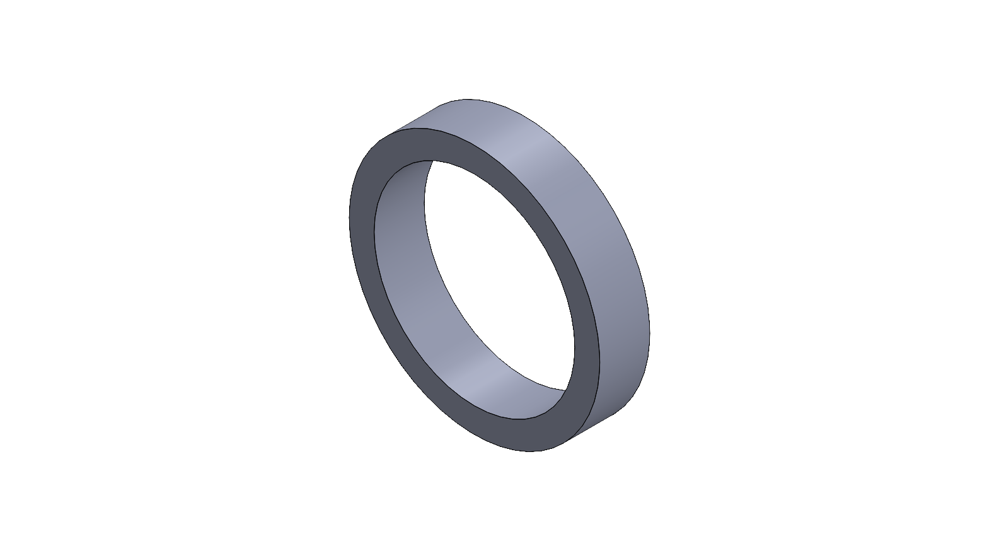 |  |
| **Shaft** |  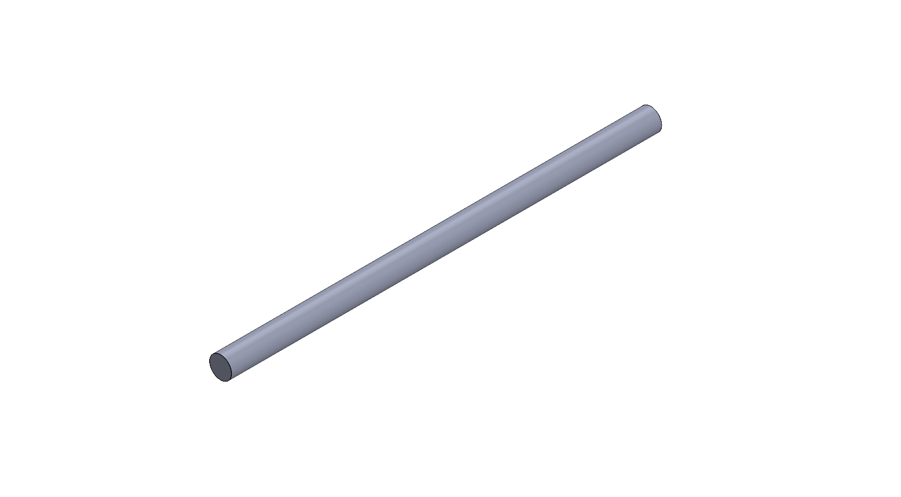 |  |
| **Synchronizer** |  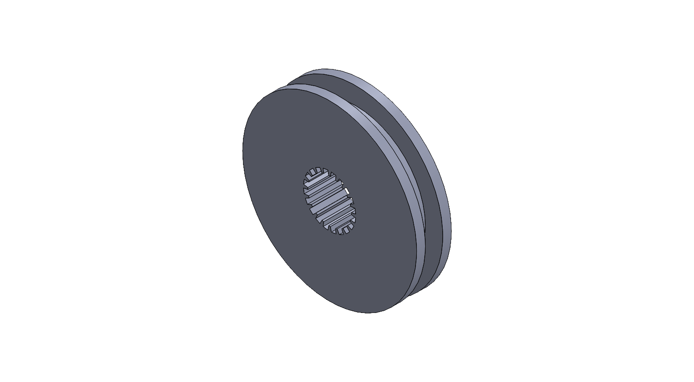 |  |
| **Synchronizer Coupler** |  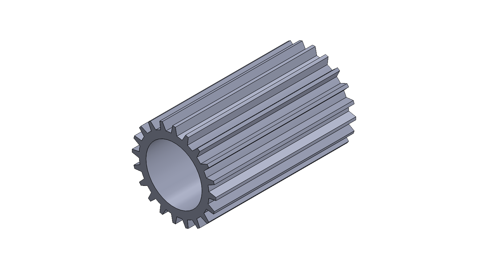 |  |
| **Shifter** |  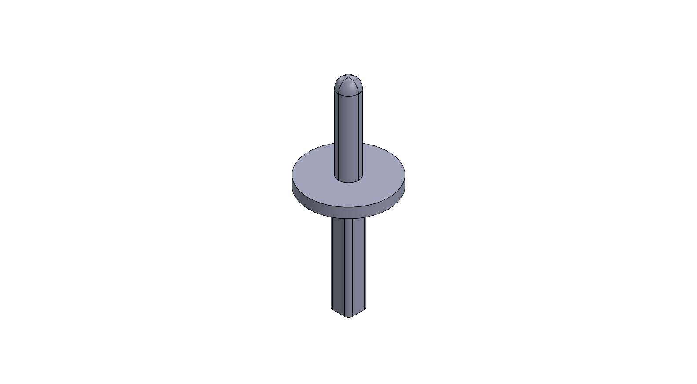 |  |
| **Shift Box** |  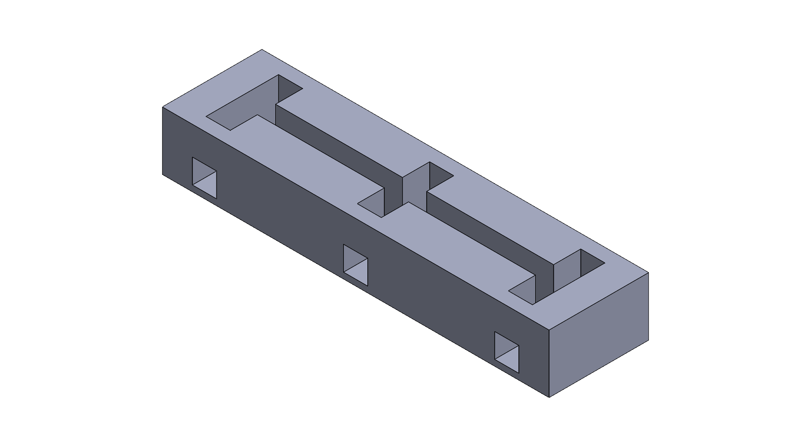 |  |
| **Housing** |  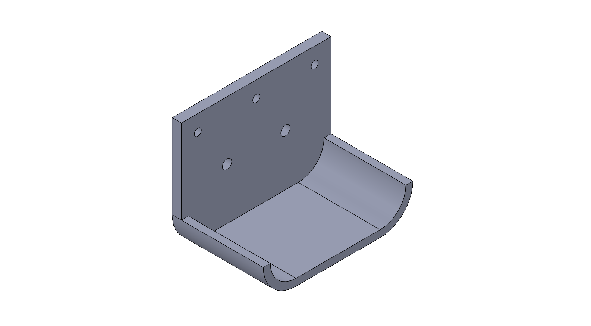 |  |
| **Mesh Gears** |  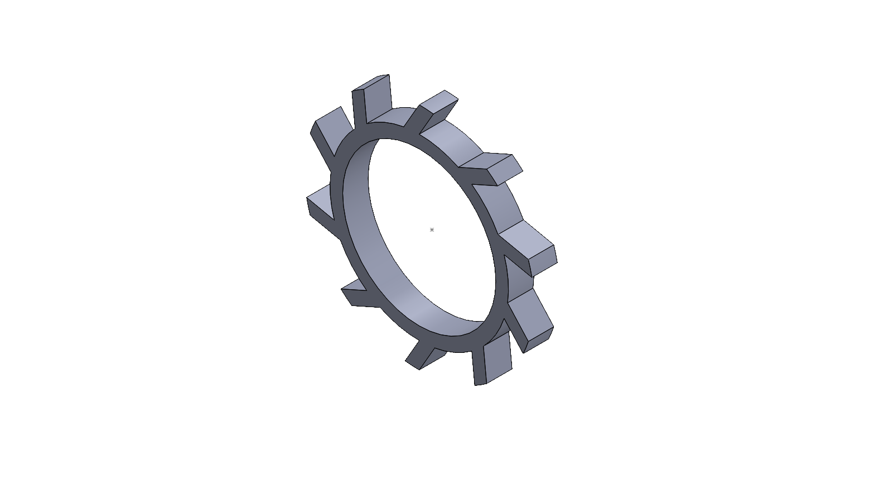 |  |
| **Gear Coupler** |  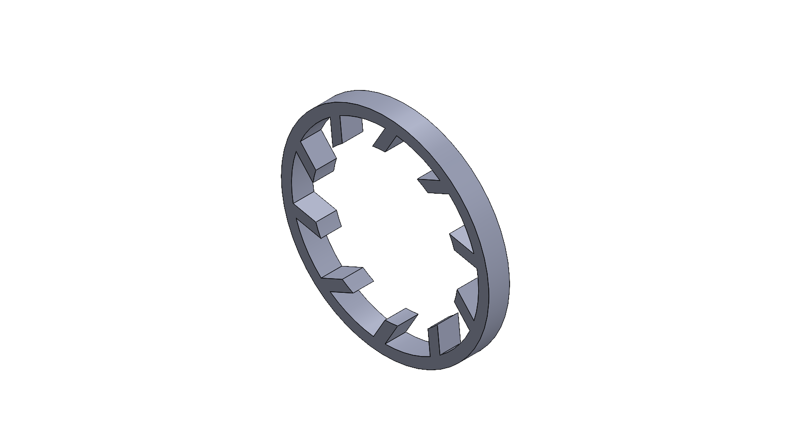 |  |
| **Fork Coupler** |  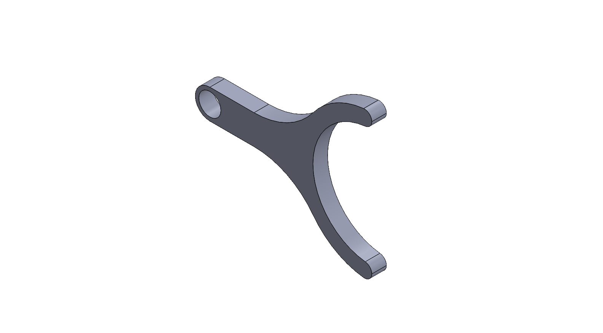 | |
| **Shift Cradler Shaft** |  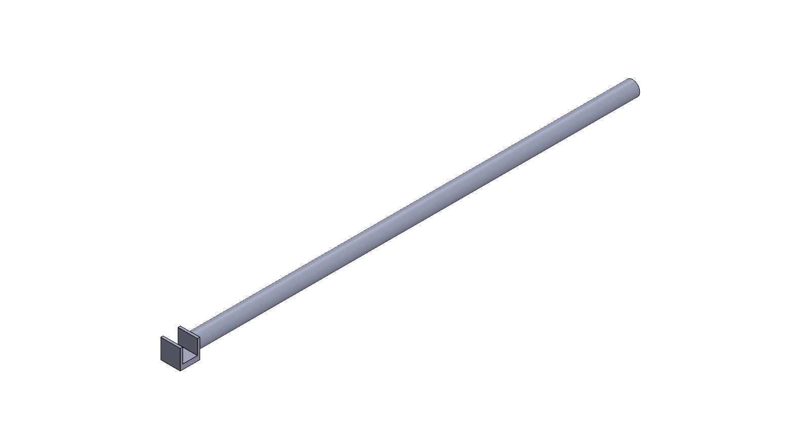 |  |
| **Input Helical Gears** |  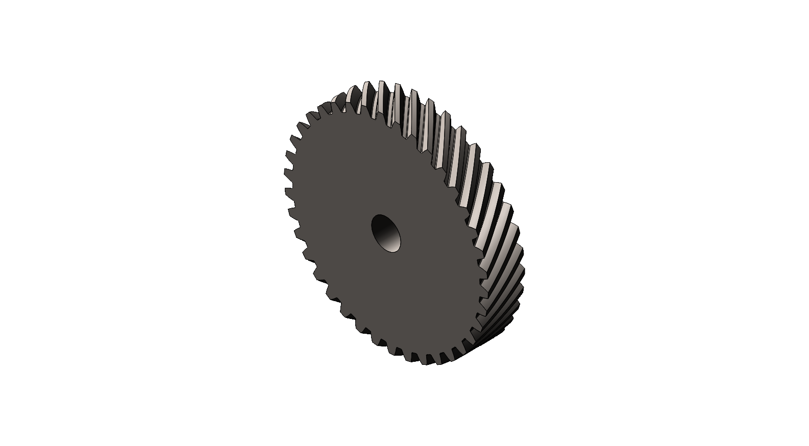 | 
| **Output Helical Gears** |  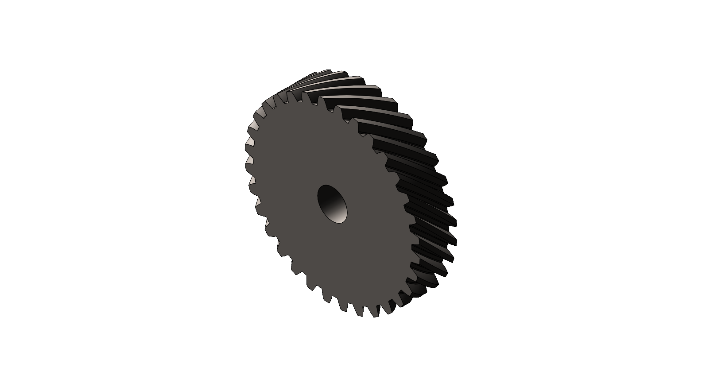 | 
  

> The 6th gear pair were used for the input and output gear images above, but each gear pair for each speed is a different tooth count and size. The image above only gives a reference as to what each one look like as all look very similar to the image given.

From the part list above, separate assemblies were made before all were combined to create the full transmission model. This method allowed us to integrate each component of the system more efficiently with less room for problems as well. Below are the documentation of the assemblies made that were then used in the full model design.

***

Parts Used in Full Synchronizer Assembly:
* 1x Synchronizer
* 2x Gear Couplers

  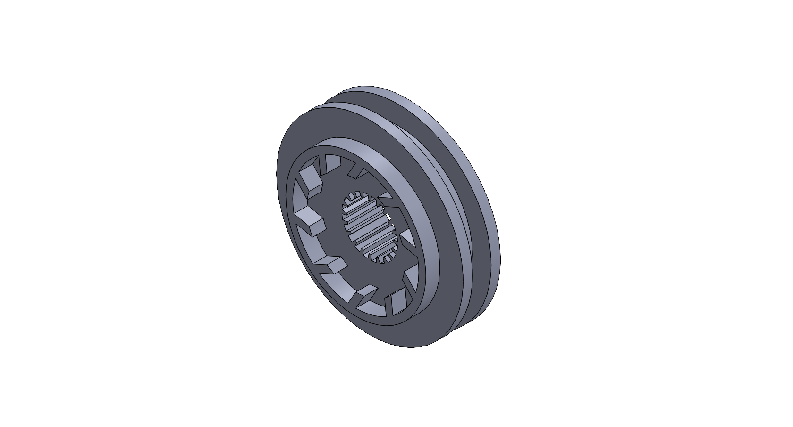
  
<em>Figure 5. Synchronizer Assembly.</em>

***

Parts & Assemblies Used in Output Shaft Assembly
* 1x Shaft
* 2x Synchronizer Couplers
* 2x Full Synchronizer Assembly
* 10x Shaft Rings
* 4x Mesh Gears
* 6x Output Helical Gears
* 2x Fork Couplers

  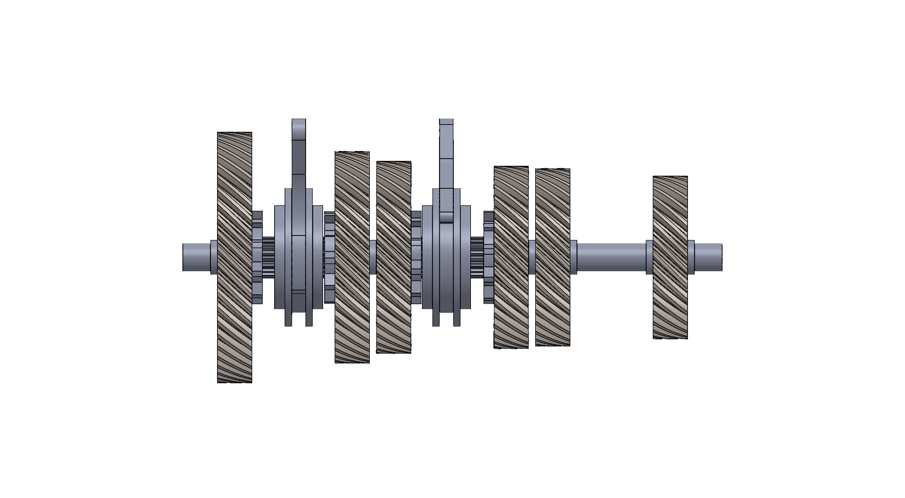
  
<em>Figure 6. Output Shaft Assembly.</em>

***

Parts/Assemblies Used in Input Shaft Assembly:
* 11x Shaft Rings
* 6x Input Helical Gears
* 1x Shaft
* 2x Mesh Gears
* 1x Fork Coupler
* 1x Full Synchronizer Assembly
* 1x Synchronizer Coupler

  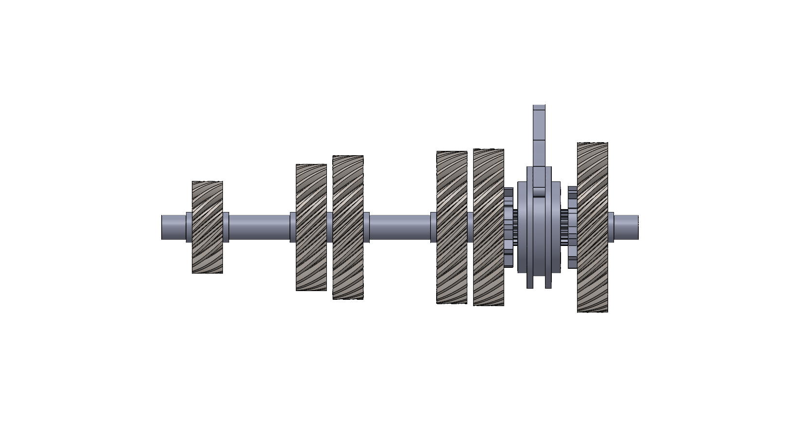
  
<em>Figure 7. Input Shaft Assembly.</em>

***
**Assembly Design Discussion:**  
The transmission model created is similar to the real world designs with a few adjustments due to some lack of knowledge and materials. Despite that, the system will act as an actual transmission with all key components designed and optimized for our half-model. While building the model, the biggest concern was the distance between all the components, especially the gear pairs. Having improper distancing can lead to a multitude of design failures, the one that was most concerning was possible seizing of gears. This would create unintended motions between the gears which could possibly affect the rotational direction. The solution that was used was to mitigate this as well as other possible system failures was to test multiple iterations of the transmission. These iterations would have different gear ratios and critical design components in order to find the perfect balance between all of the parts. These dimensions would also be used to calculate different engineering analysis which would also help determine the final dimensions used in the transmission.  
  
After finalizing every part, all that was left was to design them in SolidWorks and put it all together in an assembly build to visualize the final product. The most efficient method of combining all the parts of the system together was to create smaller subs assemblies of the system and then adding those assemblies into the final full assembly. This was done for the synchronizer, input shaft, and output shaft. These components were selected as the sub assemblies since they were the main complex components that could prove to be an issue if done improperly. Doing these in parts will mitigate any problems when it comes to mating all our parts since we could easily figure out where a problem could occur and troubleshoot. The final design after compiling all the components shows the intended motion and idea of how a manual transmission would work.

  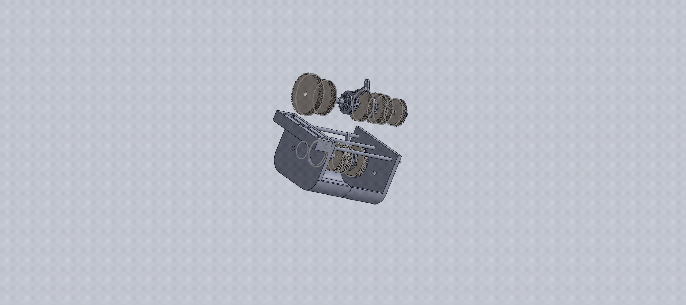
  
<em>Figure 8. Transmission Exploded View.</em>

**3D Printing Design Discussion:**  
While creating all the parts in SolidWorks, we were already accounting for how the parts could be printed when it was time to create the physical model. Each part was specifically designed so that the printer would have no issues printing out each part taking into account how a 3D printer works. There is also the chance that the part created will be slightly smaller than the dimensions listed in the print file which also proved to not be an issue due to the error range that was determined when looking through the dimensions. The only part that could have been an issue was the housing to hold all the critical components since it was significantly bigger than the size of the printer area. The solution to this was to split the housing into two sections and print each section out individually. The two sections can then be combined using any binding agent and it will then be used to store everything.

# **Anticipated Risks & Weaknesses in Prototyping**

Some anticipated risks that could be seen when prototyping is:
* **Shrinkage of 3D parts after printing could affect fit:**
  - This happens with most 3D printing materials, shouldn't affect the final product but important to keep in mind.
* **Improper sizing of parts that were accidentally overlooked when creating parts:**
  - With many different parts being created, some parts could have been made with the wrong dimensions so double checking each part before printing can save a lot of time and material.
* **Structural failure specifically in the shafts of the transmission:**
  - After doing the calculations and running some analyses, it was determined that structure should be able to with stand the stresses and torque applied to it but when it comes time to assemble the parts for the prototype, it could be a different story.

# **References**
* Brain, Marshall. “How Gear Ratios Work.” HowStuffWorks, 20 Oct. 2023, science.howstuffworks.com/transport/engines-equipment/gear-ratio.htm.  

* CarTechBooks. “Manual Transmissions Explained.” CarTechBooks, 26 May 2015, www.cartechbooks.com/blogs/techtips/manual-transmissions-explained.   

* Hufford, Kelly. “How Manual Transmission Are Manufactured and Tested.” Transpartswarehouse.com, Transparts Warehouse Inc, 30 Apr. 2024, transpartswarehouse.com/blog/post/how-manual-transmission-are-manufactured-and-tested.
* https://gearsolutions.com/features/determination-of-the-agma-j-factor-for-internal-spur-gears/
* https://www.engineersedge.com/calculators/agma_gear_tooth_bending_stress_15856.htm

